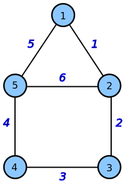

# Public Transport Route Recommendation with Manhattan's Taxi Trip Data
> Optional items are marked with *

Recommend public transport route(s) based on [TLC Trip Record Data](https://www.nyc.gov/site/tlc/about/tlc-trip-record-data.page).

## Members
1. Wan-Yu Lin (wl2484)
2. Priyanka Narain (pn2182)
3. Charvi Gupta (cg4177)

## Due Dates
1. [12/04] Data ingestion per individual (i.e. spark code for data profiling, cleaning, and ingestion + a report)
2. [12/11] Presentation in class
3. [12/15] Spark code and corresponding scripts for methodology implementation + a paper-ish report

## Data Sources
|     | Main Dataset                                                                                                                                          | Subordinate Dataset                                                                                                              | Owner           | Format    | Size         | Time Span         | HDFS Location                                               | Notes                                                                                                    |
|-----|:------------------------------------------------------------------------------------------------------------------------------------------------------|:---------------------------------------------------------------------------------------------------------------------------------|:----------------|:----------|:-------------|:------------------|:------------------------------------------------------------|:---------------------------------------------------------------------------------------------------------|
| 1   | [NYC Taxi Zones](https://catalog.data.gov/dataset/nyc-taxi-zones)                                                                                     | -                                                                                                                                | Wan-Yu Lin      | CSV-ish   | ~4MB         | -                 | /user/wl2484_nyu_edu/project/data/source/tlc/zones          | Each zone has a unique LocationID and corresponds to the same *LocationID value used in dataset-{2,3,4}. |
| 2   | [TLC Trip Record Data](https://www.nyc.gov/site/tlc/about/tlc-trip-record-data.page)                                                                  | [2.1 Yellow Trips Data Dictionary](https://www.nyc.gov/assets/tlc/downloads/pdf/data_dictionary_trip_records_yellow.pdf)         | Charvi Gupta    | PARQUET   | ~50MB/Month  | 2020.10 - 2023.09 | /user/wl2484_nyu_edu/project/data/source/tlc/yellow         |                                                                                                          |
|     |                                                                                                                                                       | [2.2 Green Trips Data Dictionary](https://www.nyc.gov/assets/tlc/downloads/pdf/data_dictionary_trip_records_green.pdf)           | Charvi Gupta    | PARQUET   | ~2MB/Month   | 2020.10 - 2023.09 | /user/wl2484_nyu_edu/project/data/source/tlc/green          |                                                                                                          |
|     |                                                                                                                                                       | [2.3 FHV Trips Data Dictionary](https://www.nyc.gov/assets/tlc/downloads/pdf/data_dictionary_trip_records_fhv.pdf)               | Priyanka Narain | PARQUET   | ~10MB/Month  | 2020.10 - 2023.09 | /user/wl2484_nyu_edu/project/data/source/tlc/fhv            |                                                                                                          |
|     |                                                                                                                                                       | [2.4 High Volume FHV Trips Data Dictionary](https://www.nyc.gov/assets/tlc/downloads/pdf/data_dictionary_trip_records_hvfhs.pdf) | Priyanka Narain | PARQUET   | ~500MB/Month | 2020.10 - 2023.09 | /user/wl2484_nyu_edu/project/data/source/tlc/fhvhv          |                                                                                                          |
| 3   | [Taxi Zone Lookup Table](https://d37ci6vzurychx.cloudfront.net/misc/taxi+_zone_lookup.csv)                                                            | -                                                                                                                                | Wan-Yu Lin      | CSV       | ~12KB        | -                 | /user/wl2484_nyu_edu/project/data/source/tlc/zone_lookup    |                                                                                                          |
| 4*  | [MTA General Transit Feed Specification (GTFS) Static Data](https://catalog.data.gov/dataset/mta-general-transit-feed-specification-gtfs-static-data) | [4.1 NYCT Subway](http://web.mta.info/developers/data/nyct/subway/google_transit.zip)                                            | Wan-Yu Lin      | CSV       | ~41MB        | -                 | /user/wl2484_nyu_edu/project/data/source/subway/nyct        |                                                                                                          |
|     |                                                                                                                                                       | [4.2 MTA Bus Company](http://web.mta.info/developers/data/busco/google_transit.zip)                                              | Wan-Yu Lin      | CSV       | ~94MB        | -                 | /user/wl2484_nyu_edu/project/data/source/bus/mta_private    |                                                                                                          |
|     |                                                                                                                                                       | [4.3 NYCT Bus (Manhattan)](http://web.mta.info/developers/data/nyct/bus/google_transit_manhattan.zip)                            | Wan-Yu Lin      | CSV       | ~79MB        | -                 | /user/wl2484_nyu_edu/project/data/source/bus/nyct/manhattan |                                                                                                          |

## Data Ingestion
> Owner: Wan-Yu Lin

Upload datasets to HDFS with `wget` and `hadoop fs` commands.

```shell
NET_ID="your-net-id"
hadoop fs -mkdir /user/${NET_ID}_nyu_edu/project
hadoop fs -mkdir /user/${NET_ID}_nyu_edu/project/data
hadoop fs -mkdir /user/${NET_ID}_nyu_edu/project/data/source
hadoop fs -mkdir /user/${NET_ID}_nyu_edu/project/data/source/tlc

# upload dataset-1
hadoop fs -mkdir /user/${NET_ID}_nyu_edu/project/data/source/tlc/zones

wget -O taxi_zones.csv https://data.cityofnewyork.us/api/views/755u-8jsi/rows.csv
hadoop fs -put taxi_zones.csv /user/${NET_ID}_nyu_edu/project/data/source/tlc/zones/taxi_zones.csv
rm taxi_zones.csv

# upload dataset-2
for t in yellow green fhv fhvhv; do 
  hadoop fs -mkdir /user/${NET_ID}_nyu_edu/project/data/source/tlc/$t; 
  for y in 2023 2022 2021; do 
    hadoop fs -mkdir /user/${NET_ID}_nyu_edu/project/data/source/tlc/$t/$y; 
    for m in {9..1}; do 
      hadoop fs -mkdir /user/${NET_ID}_nyu_edu/project/data/source/tlc/$t/$y/0$m; 
      wget https://d37ci6vzurychx.cloudfront.net/trip-data/${t}_tripdata_${y}-0${m}.parquet; 
      hadoop fs -put ${t}_tripdata_${y}-0${m}.parquet /user/${NET_ID}_nyu_edu/project/data/source/tlc/${t}/${y}/0${m}/${t}_tripdata_${y}-0${m}.parquet; 
      rm ${t}_tripdata_${y}-0${m}.parquet; 
    done; 
  done; 
  for y in 2022 2021 2020; do 
    hadoop fs -mkdir /user/${NET_ID}_nyu_edu/project/data/source/tlc/$t/$y; 
    for m in {12..10}; do 
      hadoop fs -mkdir /user/${NET_ID}_nyu_edu/project/data/source/tlc/$t/$y/$m; 
      wget https://d37ci6vzurychx.cloudfront.net/trip-data/${t}_tripdata_${y}-${m}.parquet; 
      hadoop fs -put ${t}_tripdata_${y}-${m}.parquet /user/${NET_ID}_nyu_edu/project/data/source/tlc/${t}/${y}/${m}/${t}_tripdata_${y}-${m}.parquet; 
      rm ${t}_tripdata_${y}-${m}.parquet; 
    done; 
  done; 
done;

# upload dataset-3
hadoop fs -mkdir /user/${NET_ID}_nyu_edu/project/data/source/tlc/zone_lookup

wget -O taxi_zone_lookup.csv https://d37ci6vzurychx.cloudfront.net/misc/taxi+_zone_lookup.csv
hadoop fs -put taxi_zone_lookup.csv /user/${NET_ID}_nyu_edu/project/data/source/tlc/zone_lookup/taxi_zone_lookup.csv
rm taxi_zone_lookup.csv

# upload dataset-4
## dataset-4.1
hadoop fs -mkdir /user/${NET_ID}_nyu_edu/project/data/source/subway

wget -O nyct.zip http://web.mta.info/developers/data/nyct/subway/google_transit.zip
unzip -d nyct nyct.zip
hadoop fs -copyFromLocal nyct /user/${NET_ID}_nyu_edu/project/data/source/subway/nyct
rm nyct.zip
rm -r nyct

## dataset-4.{2,3}
hadoop fs -mkdir /user/${NET_ID}_nyu_edu/project/data/source/bus
hadoop fs -mkdir /user/${NET_ID}_nyu_edu/project/data/source/bus/nyct

wget -O mta_private.zip http://web.mta.info/developers/data/busco/google_transit.zip
unzip -d mta_private mta_private.zip
hadoop fs -copyFromLocal mta_private /user/${NET_ID}_nyu_edu/project/data/source/bus/mta_private
rm mta_private.zip
rm -r mta_private

for br in manhattan; do 
  wget -O ${br}.zip http://web.mta.info/developers/data/nyct/bus/google_transit_${br}.zip; 
  unzip -d ${br} ${br}.zip; 
  hadoop fs -copyFromLocal ${br} /user/${NET_ID}_nyu_edu/project/data/source/bus/nyct/${br}; 
  rm ${br}.zip; 
  rm -r ${br}; 
done;
```

## Data Cleaning

| Dataset            | File                 | Raw Columns to Keep             | Renamed & New Columns                  | Owner           |
|--------------------|:---------------------|:--------------------------------|:---------------------------------------|:----------------|
| dataset-1          | taxi_zones.csv       | the_geom, LocationID, borough   | borough, location_id, avg_lat, avg_lon | Wan-Yu Lin      |
| dataset-2.1        | *.parquet            | PULocationID, DOLocationID      | pu_location_id, do_location_id         | Charvi Gupta    |
| dataset-2.2        | *.parquet            | PULocationID, DOLocationID      | pu_location_id, do_location_id         | Charvi Gupta    |
| dataset-2.3        | *.parquet            | PULocationID, DOLocationID      | pu_location_id, do_location_id         | Priyanka Narain |
| dataset-2.4        | *.parquet            | PULocationID, DOLocationID      | pu_location_id, do_location_id         | Priyanka Narain |
| dataset-3          | taxi_zone_lookup.csv | LocationID, Borough, Zone       | location_id, zone, borough             | Wan-Yu Lin      |
| dataset-4.{1,2,3}* | trips.txt            | route_id, trip_id               | route_id, trip_id                      | Wan-Yu Lin      |
|                    | stop_times.txt       | trip_id, stop_id, stop_sequence | trip_id, stop_id, stop_sequence        | Wan-Yu Lin      |
|                    | stops.txt            | stop_id, stop_lat, stop_lon     | stop_id, stop_lat, stop_lon            | Wan-Yu Lin      |

## Data Profiling

### dataset-1
> Owner: Wan-Yu Lin

1. number of locations per borough
2. total coordinate count per location
3. total sub-region count per locaiton
4. max sub-region coordinate count per location
5. all sub-region coordinate counts in a location
6. avg latitude and longitude per location

### dataset-2

#### dataset-2.1
> Owner: Charvi Gupta

TBA

#### dataset-2.2
> Owner: Charvi Gupta

TBA

#### dataset-2.3
> Owner: Priyanka Narain

TBA

#### dataset-2.4
> Owner: Priyanka Narain

TBA

### dataset-3
> Owner: Wan-Yu Lin

1. number of locations per borough

## Methodology
When there exist frequent taxi trips going from location-X to location-Y, both location-X and location-Y could be 
considered good candidate starting and ending stops, or 2 intermediate stops, of a public transport route.

With the [TLC Trip Record Data](https://www.nyc.gov/site/tlc/about/tlc-trip-record-data.page), we can compute the 
frequency of each taxi trip (pick-up, drop-off) pair, and identify the top K pairs that appear most frequently. 

Then, we need to figure out an applicable route from the pick-up location to the drop-off location for each of the top K 
pairs. As the explicit travel way of each taxi trip is not given in the dataset, we propose a simple approach to 
approximate a coarse-grained route using the neighboring relation between taxi zones (i.e. locations).

There exist multiple possible paths going from location-X to location-Y. For each possible path of length N-1, e.g. 
location-L_{1 -> ... -> i -> ... -> N}, where N >= 2 and 1 <= i <= N, L_1 corresponds to X, L_N corresponds to Y, and 
for all i each edge connecting L_i and L_(i+1) implies a neighboring relation and its weight represents the distance 
between L_i and L_(i+1). By adopting this setting, we can then apply the Dijkstra's Algorithm to find the shortest
(distance) path, i.e. an applicable route, going from location-X to location-Y.

The followings are the assumptions we made:
1. Every taxi zone is a small enough area where no public transport route recommendation is needed, i.e. taxi trips 
   where the starting and ending locations are the same are excluded from the datasets.
2. Every taxi zone has >= 1 neighbor, i.e. isolated locations like islands are excluded from the datasets.
3. For all locations, there exist at least one viable way going directly from itself to each of its neighbor.
4. Each taxi trip going from location-X to location-Y took the shortest distance path between the two locations.
5. Given the latitude and longitude coordinates of the taxi zone boundary provided in dataset-1, the coordinate of each 
   location is represented by the average of the geological coordinates of its borderline, and the distance between two 
   locations is the great-circle distance (unit: km) between the two average geological coordinates.

After that, the implementation for public transport route recommendation with taxi trip data could be broken down into 
the following steps:

### Step-1: Build up the neighbor zone graph
> Owner: Wan-Yu Lin

Transform **dataset-1** into a neighbor zone graph represented by an adjacency list with distance as weight.

#### Expected Output 1: Spark scripts to convert dataset-1 into graph stored in a broadcast variable
For each borough in dataset-1, load and transform locations in the borough into a graph, i.e. an adjacency list with 
distance as weight, using the neighboring relation between locations, and store it as Map in a broadcast variable, e.g. 
`Broadcast[Map[Location, List[WeightedEdge[Location]]]]`.
1. When there are >= 2 identical geological coordinates on the borderline between two locations, they are considered 
neighbors.
   * **If this assumption is rejected due to the dataset's setting**, e.g. 2 neighbor locations sharing the same 
     borderline have < 2 common geological coordinate points, **the neighboring relation between locations would be 
     manually determined** according to the [Taxi Zone Map - Manhattan](https://www.nyc.gov/assets/tlc/images/content/pages/about/taxi_zone_map_manhattan.jpg) 
     provided in the dataset.
2. The coordinate of each location is represented by the average of its boundary geological coordinates.
3. The great-circle distance between two locations is calculated using the haversine formula [2].

#### Expected Output 2: Connected locations per borough
Output a TSV file as follows with two columns to `/user/wl2484_nyu_edu/project/data/intermediate/connected_locations`, 
where each line in the file provides comma-separated isolated locations within a borough.

```tsv
borough\tlocation_ids
Bronx\t3,18,20,31,32,46,47,51,58,59,60,69,78,81,94,119,126,136,147,159,167,168,169,174,182,183,184,185,199,212,213,200,208,220,235,240,241,242,247,248,250,254,259
Brooklyn\t11,25,14,22,17,21,26,33,29,34,35,36,37,39,40,49,52,54,55,61,62,63,65,72,66,67,71,80,85,76,77,89,91,97,106,108,111,112,149,150,123,133,154,155,165,178,177,181,189,190,188,195,210,217,225,222,227,228,257,255,256
EWR\t1
Manhattan\t4,24,12,13,41,45,42,43,48,50,68,79,74,75,87,88,90,125,100,103,103,103,107,113,114,116,120,127,128,151,140,137,141,142,152,143,144,148,153,158,161,162,163,164,170,166,186,194,202,209,211,224,229,230,231,239,232,233,234,236,237,238,263,243,244,246,249,261,262
Queens\t2,7,8,9,10,15,16,19,27,28,30,38,53,56,56,64,73,70,86,82,83,92,93,95,96,98,101,102,117,121,122,124,129,134,130,139,131,132,135,138,145,146,157,160,171,173,175,179,180,191,192,193,196,203,197,198,201,205,207,215,216,218,219,226,223,258,253,252,260
Staten Island\t5,6,23,44,84,99,109,110,115,118,156,172,176,187,204,206,214,221,245,251
```

#### Expected Output 3: Isolated locations per borough
Output a TSV file with two columns as follows to `/user/wl2484_nyu_edu/project/data/intermediate/isolated_locations`, 
where each line in the file provides comma-separated isolated locations within a borough.

```tsv
borough\tlocation_ids
Bronx\t46,199
Brooklyn\t
EWR\t1
Manhattan\t103,104,105,153,194,202
Queens\t2,27,30,86,117,201
Staten Island\t
```

### Step-2: Compute taxi trip frequency
> Owner: Priyanka Narain

#### Expected Output 1: Spark scripts to convert dataset-2 into a frequency RDD of (pick-up, drop-off) pair
Transform taxi trips in **dataset-2** into (pick-up, drop-off) pairs, load the isolated_locations and apply the 
filtering rules (i.e. the 3 rules documented below), map each remaining pair to tuple ((pick-up, drop-off), 1), treat 
the 1st element as key, and then reduceByKey to compute the frequency of each unique (pick-up, drop-off) pair, e.g. 
`RDD[((Location, Location), Int)]`.
1. Discard a pair when its pick-up and drop-off locations are the same.
2. Discard a pair when its pick-up or drop-off location is outside the target borough, e.g. Manhattan.
3. Discard a pair when its pick-up or drop-off location has no neighbor (i.e. is an isolated location).

### Step-3: Transform each taxi trip in the frequency RDD into corresponding shortest path
> Owner: Priyanka Narain

#### Expected Output 1: Spark scripts to transform frequency RDD of taxi trip into frequency RDD of the shortest path
For each (pick-up, drop-off) pair in the frequency RDD, apply the Dijkstra's Algorithm to transform the pair into 
corresponding shortest path according to the neighbor zone graph stored in the broadcast variable, i.e. transform 
`RDD[((Location, Location), Int)]` into `RDD[(String, Int)]`.

**Example**
> Each node in the graph represents a location by ID, and each edge weight shows the distance between two locations.



```
Input: RDD[((1, 4), 2), ((2, 4), 1), ((1, 2), 1), ((3, 5), 1)]
Output: RDD[("1,2,3,4", 2), ("2,3,4", 1), ("1,2", 1), ("3,4,5", 1)]
```

#### Expected Output 2: Export the frequency RDD of the shortest path as a TSV file
Sort the frequency RDD in descending order by the frequency first, followed by the trip_path length, and then output to 
`/user/wl2484_nyu_edu/project/data/intermediate/trip_paths_frequency` as a 2-column TSV file, where the first column is 
the frequency and the second column is the trip_path.

**Example**

```tsv
frequency\ttrip_path
2\t1,2,3,4
2\t1,2,3
2\t2,3,4
2\t1,2
2\t2,3
2\t3,4
1\t3,4,5
1\t4,5
```

### Step-4: Compute coverage count for each trip path
> Owner: Charvi Gupta

**Trip path coverage count** represents the # of trips covered by such path, i.e. how many taxi trips can be covered if 
there's such path served as a public transport route.

#### Expected Output 1: Spark scripts to combine the frequencies of a trip path and all its substring paths

**Example**

```
Input: RDD[("1,2", 2), ("2,3", 2), ("3,4", 2), ("1,2,3", 2), ("2,3,4", 2), ("1,2,3,4", 2), ("3,4", 1), ("4,5", 1), ("3,4,5", 1)]
Output: RDD[("1,2,3,4", 12), ("1,2,3", 6), ("2,3,4", 6), ("3,4,5", 4), ("1,2", 2), ("2,3", 2), ("3,4", 2), ("4,5", 1)]
```

#### Expected Output 2: Export the trip path coverage count RDD as a TSV file
Sort the trip path coverage count RDD in descending order by the coverage count first, followed by the trip_path length, 
and then output to `/user/wl2484_nyu_edu/project/data/intermediate/trip_paths_coverage_count` as a 2-column TSV file, 
where the first column is the coverage_count and the second column is the trip_path.

**Example**

```
Input: RDD[("1,2,3,4", 12), ("1,2,3", 6), ("2,3,4", 6), ("3,4,5", 4), ("1,2", 2), ("2,3", 2), ("3,4", 2), ("4,5", 1)]

Output:
coverage_count\ttrip_path
12\t1,2,3,4
6\t1,2,3
6\t2,3,4
4\t3,4,5
2\t1,2
2\t2,3
2\t3,4
1\t4,5
```

### Step-5: Recommend routes
> Owner: Charvi Gupta

**[Approach-1]**
Select the top k trip paths according to coverage count, and join them with dataset-3 to provide human-readable routes 
for public transport.

#### Expected Output 1: Spark scripts to transform top k paths with the most coverage count into human-readable routes

**Example**

```scala
# select the top k paths of at least length m according to coverage count
Input: k = 5, m = 3, RDD[("1,2,3,4", 12), ("1,2,3", 6), ("2,3,4", 6), ("3,4,5", 4), ("1,2", 2), ("2,3", 2), ("3,4", 2), ("4,5", 1)]
Output: [("1,2,3,4", 12), ("1,2,3", 6), ("2,3,4", 6)]

# join candidate paths with dataset-3 to provide human-readable routes
Input: [("1,2,3,4", 12), ("1,2,3", 6), ("2,3,4", 6)]
Output: 
RDD[
    ("Penn Station/Madison Sq West,Flatiron,West Village,Hudson Sq", 12), 
    ("Penn Station/Madison Sq West,Flatiron,West Village", 6), 
    ("Flatiron,West Village,Hudson Sq", 6),
    ("West Village,Hudson Sq,SoHo", 4)
]
```

#### Expected Output 2*: Export top k human-readable routes as a TSV file sorted in descending order by coverage count
Sort the coverage count RDD of human-readable route in descending order by the coverage count first, followed by the 
route length, and then output to `/user/wl2484_nyu_edu/project/data/result/rec_routes_coverage_count` as a 2-column TSV 
file, where the first column is the coverage_count and the second column is the human-readable route.

**Example**

```
Input: 
RDD[
    ("Penn Station/Madison Sq West,Flatiron,West Village,Hudson Sq", 12), 
    ("Penn Station/Madison Sq West,Flatiron,West Village", 6), 
    ("Flatiron,West Village,Hudson Sq", 6),
    ("West Village,Hudson Sq,SoHo", 4)
]

Output:
coverage_count\troute
12\tPenn Station/Madison Sq West,Flatiron,West Village,Hudson Sq
6\tPenn Station/Madison Sq West,Flatiron,West Village
6\tFlatiron,West Village,Hudson Sq
4\tWest Village,Hudson Sq,SoHo
```

**[Approach-2]**
Apply clustering method and combine the paths according an overlap threshold or something, and set m for # of locations or the length of the path in a cluster.

### Step-6: Compute the coverage of taxi trips by the top k recommended routes
> Owner: Charvi Gupta

Calculate the number of taxi trips that can be covered by the top k recommended routes, i.e. for each path in the trip 
path frequency TSV file, take its frequency into count if it is a substring of one or more of the top k recommended 
routes, and finally divide the number of taxi trips covered by the total number of taxi trips.

#### Expected Output 1: Spark scripts to compute and output the coverage of taxi trips by the top k recommended routes


### Step-7*: Join dataset-4 with dataset-1 to output the zone path per public transport route
> Owner: Wan-Yu Lin

TBA

### Step-8*: Compute the coverage of taxi trips by the public transport (e.g. subway and bus)
> Owner: Wan-Yu Lin

Calculate the number of taxi trips that can be covered by subway and bus routes, i.e. for each path in the trip path 
frequency TSV file, take its frequency into count if it is a substring of one or more of the subway and bus routes, and 
finally divide the number of taxi trips covered by the total number of taxi trips.

#### Expected Output 1: Spark scripts to compute and output the coverage of taxi trips by subway and bus routes


## Insights

TBA


## Discussions

TBA


## References
1. [Graph algorithms in Scala](https://github.com/Arminea/scala-graphs)
2. [Scala: Calculating the Distance Between Two Locations](https://dzone.com/articles/scala-calculating-distance-between-two-locations)
3. [RDD vs Dataframe vs Dataset](https://www.databricks.com/blog/2016/07/14/a-tale-of-three-apache-spark-apis-rdds-dataframes-and-datasets.html)
4. [Spark SQL: API Doc (Scala)](https://spark.apache.org/docs/latest/api/scala/org/apache/spark/sql/index.html)
5. [Reading Command-Line Arguments in Scala](https://www.baeldung.com/scala/read-command-line-arguments)
6. [Spark Scala: Operations on One Column](https://haya-toumy.gitbook.io/spark-notes/spark-scala/spark-scala/operations-on-one-column)
7. [Spark SQL UDFs](https://jaceklaskowski.gitbooks.io/mastering-spark-sql/content/spark-sql-udfs.html)
8. [Sum a list of tuples by foldLeft](https://stackoverflow.com/questions/30154736/how-to-sum-a-list-of-tuples)
